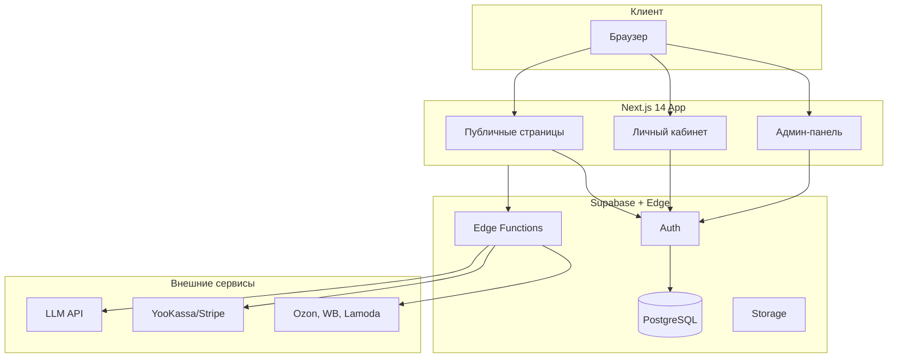
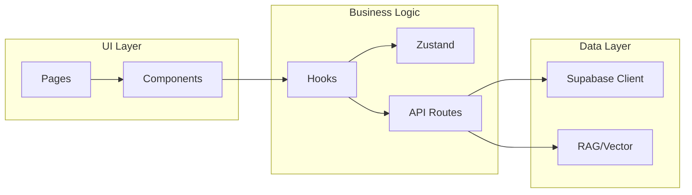

# Project.md — HAEE Neurocosmetics D2C Portal

Детальное и структурированное описание проекта. Обновляется при изменениях архитектуры или добавлении функциональных требований.

**Версия документа**: 1.0  
**Последнее обновление**: 2025-03-05

---

## 1. Цели проекта

### 1.1 Бизнес-цели
- **D2C-продажи**: Прямые продажи косметического продукта HAEE (эндогенный пептид Ac-His-Ala-Glu-Glu-NH2) через веб-портал.
- **B2B-канал**: Привлечение клиник и салонов красоты для оптовых закупок.
- **Удержание**: Поддержка клиентов на протяжении 2–3-месячного курса применения (10 ампул, мезороллер).
- **Автоматизация**: AI-агенты для консультирования, снижения нагрузки на поддержку и повышения конверсии.

### 1.2 Технические цели
- Высокая производительность (Web Vitals, быстрая загрузка).
- Безопасность: RBAC, аудит, защита персональных данных.
- Масштабируемость: готовность к росту трафика и интеграциям.
- Поддерживаемость: чистая архитектура, типизация, документация.

---

## 2. Архитектура

### 2.1 Общая схема

### 2.2 Роли и RBAC

| Роль | Доступ | Ключевые возможности |
|------|--------|----------------------|
| **Guest** | Публичный сайт | Просмотр, AI-консультант, добавление в корзину |
| **Retail (B2C)** | Личный кабинет | Заказы, трекинг, AI Care Companion, подписки |
| **Wholesale (B2B)** | B2B-раздел | Оптовые заказы, счета, документооборот |
| **Manager** | CRM | Обработка заказов, чат с клиентами, маркетплейсы |
| **Administrator** | Полный доступ | Аналитика, пользователи, AI-настройки, аудит |

### 2.3 Структура маршрутов

| Маршрут | Назначение | Роль |
|---------|------------|------|
| `/` | Главная, hero, CTA | Guest+ |
| `/science` | Наука, патенты (RU 2826728) | Guest+ |
| `/shop` | Каталог, AI Sales Agent | Guest+ |
| `/dashboard` | Личный кабинет пользователя | B2C, B2B |
| `/dashboard/admin` | Админ-панель | Manager, Admin |

### 2.4 AI-агенты

| Агент | Расположение | Цель | Инструменты |
|-------|--------------|------|-------------|
| Sales Consultant | Публичные страницы | Консультация, добавление в корзину | `add_to_cart` |
| B2B Consultant | B2B-раздел | Сбор лидов для отдела продаж | `create_b2b_lead` |
| Care Companion | Личный кабинет | Поддержка курса, реордер | `reorder_kit` |
| Admin Copilot | Админ-панель | Аналитика, ответы на запросы | — |

### 2.6 Продуктовая линейка HAEE (системная нейрокосметология)

Линейка опирается на научно доказанную эффективность тетрапептида HAEE (норма ~430 пг/мл) и косметические свойства (осветление пигментации, антиоксидантная защита).

| Комплект | РРЦ | Назначение |
|----------|-----|------------|
| **HAEE Starter: Системный старт** | 12 900 ₽ | Первое знакомство: 10 ампул, мезороллер, протокол. Курс 10 процедур (7–10 дней), ~2,5 мес. |
| **HAEE Intensive: Нейро-Регенерация** | 19 900 ₽ | Усиленный курс при фотостарении/дефиците пептида: 20 ампул, мезороллер, крем SPF 30+. |
| **HAEE Refill: Поддерживающий уход** | 8 500 ₽ | Поддержание нормы HAEE, предотвращение пигментации. 10 ампул, 1 процедура в 2–4 нед. |
| **HAEE Professional: B2B-Box** | По запросу | Клиники и нейрореабилитация: диспенсер 50–100 ампул, насадки для аппаратов, AI-аттестация. |

**Ценообразование**: Premium MedTech; себестоимость АФС на дозу &lt; 350 ₽; позиционирование за счёт нейропротекторного потенциала (снижение амилоидных бляшек на 55%).  
**Маркетинговый месседж**: Сайт и AI-боты акцентируют, что покупка HAEE — инвестиция не только в уход за кожей, но и в **эндогенный щит для мозга**. Каталог: `lib/data/products.ts`; магазин: `/shop`.

### 2.7 Компоненты и взаимодействия

---

## 3. Этапы разработки

### Этап 1: Фундамент (MVP)
- Инициализация Next.js 14, TypeScript, Tailwind, Supabase.
- Базовая аутентификация и RBAC.
- Публичные страницы: главная, science, shop (без AI).
- Простой каталог и корзина.

### Этап 2: Коммерция
- Интеграция платежей (YooKassa/Stripe).
- Оформление заказа, статусы доставки.
- Личный кабинет: заказы, профиль.

### Этап 3: AI-агенты
- Sales Consultant с RAG.
- Care Companion в личном кабинете.
- B2B Consultant и сбор лидов.

### Этап 4: Администрирование
- Админ-панель: аналитика, CRM.
- Настройки AI (модели, промпты).
- Интеграции: маркетплейсы, банк, уведомления.

### Этап 5: Масштабирование
- Оптимизация производительности.
- Расширение интеграций.
- A/B-тесты, мониторинг.

#### 5.1 A/B-тестирование
- **Модуль** `lib/ab/`: эксперименты (experiments.ts), назначение варианта (variant.ts), хук useExperiment.
- **Cookie**: `ab_visitor` — идентификатор посетителя, `ab_<experimentId>` — вариант (A/B).
- **Детерминированность**: hash(visitor_id + experiment_id) → A или B.
- **Демо**: эксперимент `hero_cta` — текст CTA в Hero («Купить курс» vs «Начать курс»).

---

## 4. Технологии и стандарты

### 4.1 Стек

| Категория | Технология | Обоснование |
|-----------|------------|-------------|
| Framework | Next.js 14 (App Router) | SSR, SEO, API routes |
| Язык | TypeScript (strict) | Типобезопасность |
| Стили | Tailwind, Shadcn UI, Framer Motion | Консистентность, доступность |
| БД и Auth | Supabase (PostgreSQL) | BaaS, RLS, реальное время |
| State | Zustand | Лёгкость, минимум бойлерплейта |
| AI | Vercel AI SDK, LangChain.js | Стриминг, инструменты |
| Платежи | YooKassa / Stripe | Локальный и международный рынок |
| Валидация | Zod | Схемы API и форм |

### 4.2 Стандарты кода
- **Компоненты**: функциональные, Server Components по умолчанию.
- **Стили**: только Tailwind, без лишнего custom CSS.
- **API**: строгая типизация, Zod для валидации.
- **Ошибки**: централизованная обработка, React Suspense для загрузки.
- **Доступность**: a11y, семантическая разметка.
- **SEO**: Schema.org JSON-LD, sitemap, OpenGraph.

### 4.3 Design System
- **Primary**: Deep Navy Blue (#0B132B), Champagne Gold (#D4AF37).
- **Secondary**: Pure White (#FFFFFF), Medical Ice (#E2E8F0).
- **Стиль**: Premium MedTech, glassmorphism, микро-анимации.
- **Типографика**: Sans-Serif (Inter) для UI, Serif (Playfair Display) для заголовков.
- **Доступность (a11y)**: Skip link «Перейти к контенту», focus-visible (ring-gold), aria-label на иконках, aria-expanded на мобильном меню. Подробнее: [design-audit.md](./design-audit.md).
- **Секции**: опциональная шкала отступов `--section-py` / `--section-py-lg` в globals.css.

#### 4.3.1 Типографическая шкала (MedTech)

Единая шкала размеров и tracking для консистентности. Использовать в ключевых блоках: лендинг, /science, /shop, карточки.

| Уровень | Tailwind / класс | Размер | Назначение | Tracking |
|---------|------------------|--------|------------|----------|
| **Display** | `typography-display` | 3rem / 3.5rem / 4rem | Hero H1 | tracking-tight |
| **H1** | `typography-h1` | 2.25rem / 2.5rem | Заголовок страницы | tracking-tight |
| **H2** | `typography-h2` | 2rem / 2.25rem | Заголовок секции | tracking-tight |
| **H3** | `typography-h3` | 1.25rem / 1.5rem | Заголовок карточки | default |
| **Lead** | `typography-lead` | 1.125rem | Подзаголовок, вводный текст | default |
| **Body** | `typography-body` | 1rem | Основной текст | default |
| **Body small** | `typography-body-sm` | 0.875rem | Описание, метаданные | default |
| **Caption** | `typography-caption` | 0.75rem | Подписи, хинты | default |
| **Badge** | `typography-badge` | 0.75rem | Бейджи, лейблы (uppercase) | tracking-widest |
| **Price/Stat** | `typography-stat` | 1.5rem / 2rem | Цены, счётчики | default |

Классы определены в `globals.css`. Заголовки используют `font-serif`, body — `font-sans`.

---

## 5. Безопасность

- **Auth**: Supabase Auth (JWT, refresh tokens).
- **RBAC**: Row Level Security в PostgreSQL.
- **API**: проверка ролей, rate limiting.
- **Аудит**: журнал действий в админ-панели.
- **Данные**: шифрование чувствительных полей, соответствие требованиям по персональным данным.

---

## 6. Производительность

- **Core Web Vitals**: LCP, FID, CLS в целевом диапазоне.
- **Изображения**: Next.js Image, WebP, lazy loading.
- **Кэширование**: ISR, кэш API-ответов.
- **Бандл**: code splitting, tree shaking.

---

## 7. Консистентность и поддерживаемость

- **Структура**: модульная, по фичам/доменам.
- **Документация**: Project.md, Tasktracker.md, Diary.md, комментарии в коде.
- **Версионирование**: Semantic Versioning (VERSION, VERSION_HISTORY).
- **Линтеры**: ESLint, Prettier, pre-commit hooks.
- **Тесты**: unit для логики, e2e для критичных сценариев.

---

## 8. Связанные документы

| Документ | Описание |
|----------|----------|
| [project-architecture.md](../project-architecture.md) | Детали архитектуры и спецификации |
| [ai-system-prompts.md](../ai-system-prompts.md) | Промпты AI-агентов |
| [Tasktracker.md](./Tasktracker.md) | Отслеживание задач по этапам и приоритетам |
| [Diary.md](./Diary.md) | Дневник наблюдений |
| [changelog.md](./changelog.md) | Журнал изменений |
| [qa.md](./qa.md) | Вопросы по архитектуре |
